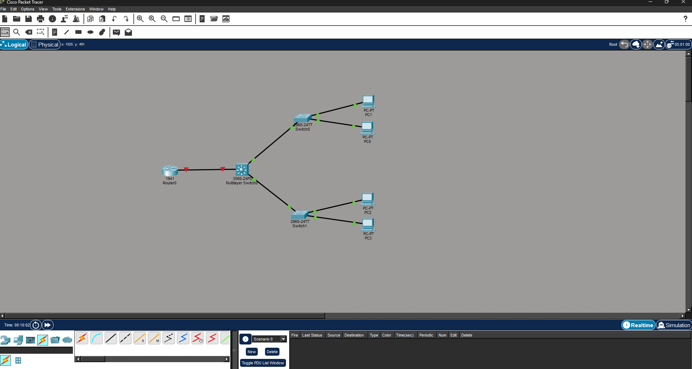
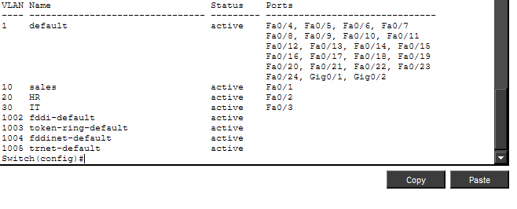
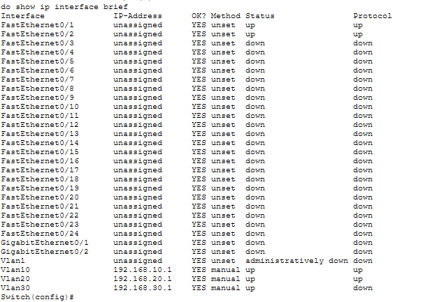

# Vlan-intervlan-routing-lab
Cisco Packet Tracer lab configuring VLANs, access ports, and inter-VLAN routing using SVIs on a Cisco Catalyst 3560 multilayer switch

# VLAN & Inter-VLAN Routing Lab

## Overview
This lab demonstrates how to configure VLANs, assign access ports, and enable inter-VLAN routing using Switched Virtual Interfaces (SVIs) on a Cisco Catalyst 3560 multilayer switch in Cisco Packet Tracer.

## Objectives
- Create and name VLANs for departmental network segmentation
- Assign switch access ports to specific VLANs
- Configure SVIs to enable inter-VLAN routing at Layer 3
- Verify connectivity and routing between VLANs

  ## Lab Environment
- **Platform:** Cisco Packet Tracer
- **Device:** Cisco Catalyst 3560 Multilayer Switch (WS-C3560-24PS)
- **IOS Version:** 12.2(37)SE1

## VLAN Design
| VLAN ID | Name  | Subnet           | Gateway       | Assigned Port |
|---------|-------|------------------|---------------|---------------|
| 10      | Sales | 192.168.10.0/24  | 192.168.10.1  | Fa0/1         |
| 20      | HR    | 192.168.20.0/24  | 192.168.20.1  | Fa0/2         |
| 30      | IT    | 192.168.30.0/24  | 192.168.30.1  | Fa0/3         |

## Configuration Steps

 ### Step 1 
 - Create VLANs
  
 -  vlan 10
 -  name Sales
 - exit
 
 - vlan 20
 - name HR
 - exit
 
 - vlan 30
 - name IT
 - exit

## Step 2 Assign Access Ports 

- interface fastethernet 0/1
- switchport mode access
 switchport access vlan 10
 exit

- interface fastethernet 0/2
- switchport mode access
- switchport access vlan 20
- exit

- interface fastethernet 0/3
- switchport mode access
- switchport access vlan 30
- exit

 ### Step 3 Enable IP Routing and Configure SVIs
- ip routing

- interface vlan 10
- ip address 192.168.10.1 255.255.255.0
- no shutdown
- exit

- interface vlan 20
- ip address 192.168.20.1 255.255.255.0
- no shutdown
- exit

- interface vlan 30
- ip address 192.168.30.1 255.255.255.0
- no shutdown
- exit

- ## Screenshots

### Network Topology

### VLAN Verification

### SVI Verification

  ## Verification

- show vlan brief
-  Confirmed VLANs 10, 20, and 30 active with correct port assignments
-  VLAN 10 Sales — Fa0/1
-   VLAN 20 HR — Fa0/2
-  ∙VLAN 30 IT — Fa0/3

-  show ip interface brief Confirmed SVI status:
-   Vlan10 — 192.168.10.1 — up/up
-   Vlan20 — 192.168.20.1 — up/up
-   Vlan30 — 192.168.30.1 — up/down (no end device connected to Fa0/3 in simulation)
-
-   Key Concepts Demonstrated
-   VLAN segmentation — isolating departmental traffic at Layer 2
-   Access port configuration — assigning switch ports to specific VLANs
-   Layer 3 switching — using SVIs instead of a router for inter-VLAN routing
-  IP routing — enabling the multilayer switch to route between subnets Tools Used
-  Cisco Packet Tracer
-  Cisco IOS CLI
-
   Author Akel Swinton — github.com/akel-swinton

